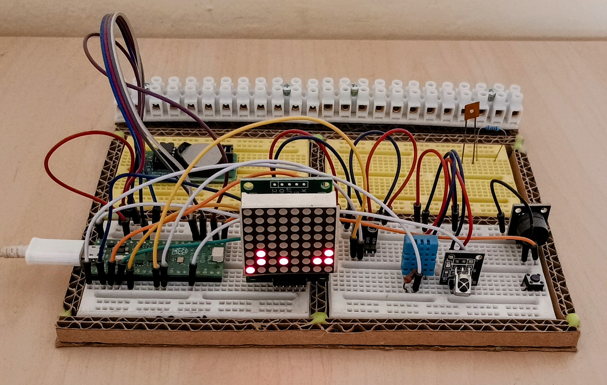
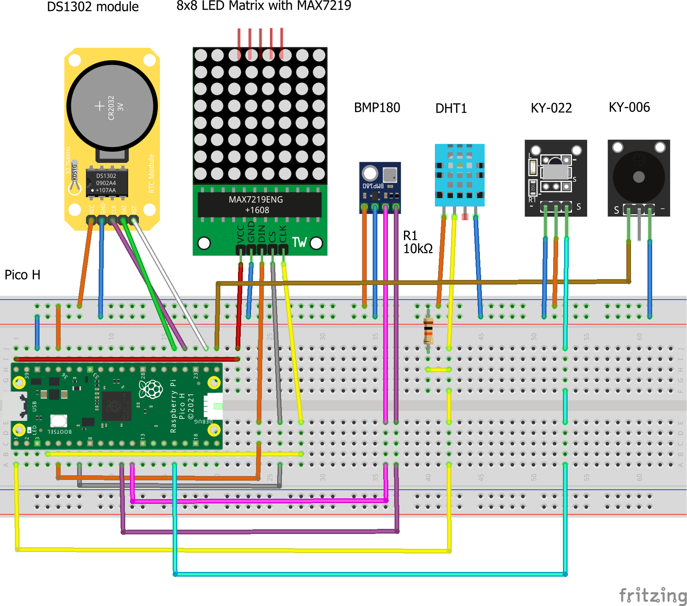
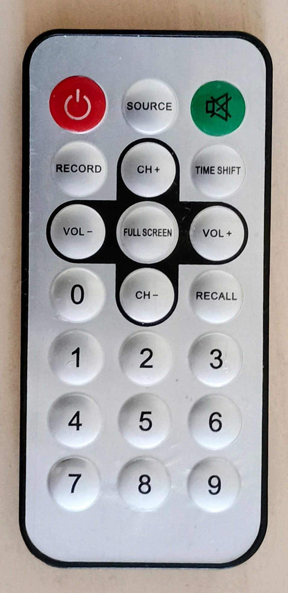

# RpiPico_8x8_LED_matrix
The complex training project including Raspberry Pi Pico, Micropython, MAX7219 LED matrix, RTC DS1302, DHT11, BMP180, passive buzzer and IR remote control.

# Binary alarm clock with RTC and weather sensors

The original goal of this project was to learn how to work with a matrix LED display and an RTC module. But, later on, other modules were added and it became a comprehensive learning project. 

Now, it displays not only date and time in binary or BCD format. It can display time, date, day of week, three temperatures, humidity, atmospheric pressure and altitude also in characters. Built in alarm clock plays melody on passive buzzer. And it can be controlled by IR remote control. 

## Components

- Raspberry Pi Pico width soldered header and installed MicroPython  
- MAX7219 LED matrix 8x8 module  
- RTC DS1302 module (includinb battery)  
- DHT11 temp/humid sensor
- resistor 10k
- IR receiver as KY-022 module  
- IR remote control using NEC protocol 
- passive buzzer as KY-006 module  
- breadboard  
- wires  
- computer with Thonny Python IDE installed  

## Wiring

  

Wiring table:

| **Component Name** | **Label**  | **Pin**       | **Connected To** |
|----------------------|-----------|--------------|---------------|
| KY-022 Infrared Receiver Module | KY-022 | S  | Raspberry Pi Pico H (GP12) |
| KY-022 Infrared Receiver Module | KY-022 | GND | Raspberry Pi Pico H (GND) |
| KY-022 Infrared Receiver Module | KY-022 | Win | Raspberry Pi Pico H (3V3) |
| KY-006 Passive Buzzer Module | KY-006 | S  | Raspberry Pi Pico H (GP16) |
| KY-006 Passive Buzzer Module | KY-006 | GND | Raspberry Pi Pico H (GND) |
| Humidity and Temperature Sensor DHT11  | DHT1 | VCC | 220Ω Resistor (Pin 0) |
| Humidity and Temperature Sensor DHT11 | DHT1 | Data-signal | 220Ω Resistor (Pin 1), Raspberry Pi Pico H (GP0) |
| Humidity and Temperature Sensor DHT11 | DHT1 | Vcc | Raspberry Pi Pico H (3V3) |
| Humidity and Temperature Sensor DHT11 | DHT1 | GND | Raspberry Pi Pico H (GND) |
| Barometric Pressure Sensor BMP180 | BMP180 | SDA | Raspberry Pi Pico H (GP8) |
| Barometric Pressure Sensor BMP180 | BMP180 | SCL | Raspberry Pi Pico H (GP9) |
| Barometric Pressure Sensor BMP180 | BMP180 | VCC | Raspberry Pi Pico H (3V3) |
| Barometric Pressure Sensor BMP180 | BMP180 | GND | Raspberry Pi Pico H (GND) |
| RTC_DS1302_module | DS1302 module | RST | Raspberry Pi Pico H (GP17) |
| RTC_DS1302_module | DS1302 module | DAT | Raspberry Pi Pico H (GP19) |
| RTC_DS1302_module | DS1302 module | CLK | Raspberry Pi Pico H (GP18) |
| RTC_DS1302_module | DS1302 module | VCC | Raspberry Pi Pico H (3V3) |
| RTC_DS1302_module | DS1302 module | GND | Raspberry Pi Pico H (GND) |
| 8x8 LED Matrix with MAX7219 | MAX7219 | DIN | Raspberry Pi Pico H (GP3) |
| 8x8 LED Matrix with MAX7219 | MAX7219 | CS | Raspberry Pi Pico H (GP5) |
| 8x8 LED Matrix with MAX7219 | MAX7219 | CLK | Raspberry Pi Pico H (GP2) |
| 8x8 LED Matrix with MAX7219 | MAX7219 | VCC | Raspberry Pi Pico H (VBUS) |
| 8x8 LED Matrix with MAX7219 | MAX7219 | GND | Raspberry Pi Pico H (GND) |  
|  |  |  |  |  

*Comment: This table was created by Copilot from XML Netlist file generated by [Fritzing](https://fritzing.org/).*  

### Recomendation

Don't connect all components together at once. First test the PICO, then connect the matrix LED display and test its functionality. Then proceed with the other components by the same way.

## How to get it working

### PICO preparation

Place PICO with installed MicroPython into breadboard, connect to computer and run Thonny. If you see in "Shell" tab REPL console working, PICO is OK. Download content of src directory from this reporsitory to PICO. 

Following steps can be done in any order. It is recomended always disconnect PICO from power before connection of next components.

### LED matrix

Place LED matrix module into breadboard - use pins under MAX7219 circuit. Connect pin modules according to wiring table or picture above. Now connect PICO to computer, restart Thonny and test if it is working using [text_show.py](./src/text_show.py).

### RTC module

When the RTC module is connected, you will probably need to set the time in it. This can be done using [ds1302_set_time.py](./src/ds1302_set_time.py) . it takes advantage of the fact that Thonny IDE, as soon as PICO is connected, writes time from the computer to the internal RTC that PICO has. the program first reads the time set in the DS1302 and then writes the time from the internal RTC Pico to the DS1302. At the same time, the program serves as a test of functionality.

### DHT-11 module

After module connection use program [dht11_test.py](./src/dht11_test.py)

### BMP180 module

Functionality of BMP180 module can be tested by program [bmp180_test.py](./src/bmp180_test.py).

### Passive buzzer

Program [buzzer_test.py](./src/buzzer_test.py) will test right work of passive buzzer.

### IR remote control

Getting the IR remote control to work could be the most complicated part. Basic funtionality can be tested using [ir_remote_test.py](./src/ir_remote_test.py). However, this program is designed mainly to find out the numerical codes of the individual buttons of the remote control. Within this project, only the "numeric" buttons 0 to 9 and the "RECALL" button are used on the remote control so far:  

<table>
    <tr><td><b>Button</b></td><td><b>Code<b></td><td>&nbsp;</td></tr>
    <tr><td>0</td><td>18</td><td rowspan="11"> </td></tr>
    <tr><td>1</td><td>9</td></tr>
    <tr><td>2</td><td>29</td></tr>
    <tr><td>3</td><td>31</td></tr>
    <tr><td>4</td><td>13</td></tr>
    <tr><td>5</td><td>25</td></tr>
    <tr><td>6</td><td>27</td></tr>
    <tr><td>7</td><td>17</td></tr>
    <tr><td>8</td><td>21</td></tr>
    <tr><td>9</td><td>23</td></tr>
    <tr><td>RECALL</td><td>28</td></tr>
    <tr><td> </td><td> </td><td> </td></tr>
</table>

Once you have identified the numeric button codes of your remote control, change the codes in the **obsluha** function in [**binclock.py**](./src/binclock.py) program according to them. Ofcourse, only if it will be necessary.

***Important***: *The remote control used in this project works with **NEC** signal protocol. For another protocol, the MicroPython modules and program itself must be modified accordingly!*

### Get working everything together

If every components works fine, run program **binclock.py**.

## Features

**1. Every odd minute current time in pure binary format is shown:**

| **WD** |  **.** | **YEAR** | **MONTH** | **DAY** | **HOUR** | **MIN** | **SEC** | **Bit weight** |
|-----------|-----------|-----------|-----------|-----------|-----------|-----------|-----------|-----------|
|  |  |  |  |  |  |  |  | 128  |
|  |  |  |  |  |  |  |  | 64 |
|  |  |  |  |  |  |  | 🔴 | 32 |
|  |  | 🔴 |  | 🔴 | 🔴 | 🔴 | 🔴 | 16 |
|  |  | 🔴 |  | 🔴 |   |  | 🔴 | 8 |
|  |  |  |  | 🔴 |  | 🔴 |  | 4 |
|  |  |  | 🔴| 🔴 |  | 🔴 | 🔴 | 2 |
| 🔴 |  | 🔴 | 🔴 | 🔴 | 🔴 | 🔴 | 🔴 | 1 |
| 1 |  | 25 | 3 | 31 | 17 | 23 | 59 |   |

Example shows Monday, March 31, 2025, time 17:23:59. Seconds change can be seen for a full minute.

**2. Every even minute curent time in [BCD](https://en.wikipedia.org/wiki/Binary-coded_decimal) format is shown:**

| **HR** | **HR**| **.** | **MI** | **MI** | **.** | **SE** | **SE** | **Bit weight** |
|-----------|-----------|-----------|-----------|-----------|-----------|-----------|-----------|-----------|
|  |  |  |  |  |  |  |  | 128  |
|  |  |  |  |  |  |  |  | 64 |
|    |    |    |    |    |    |    |   | 32 |
|    |    |   |    |   |   |   |    | 16 |
|    |    |   |    |  |   |    | 🔴 | 8 |
|    |  🔴  |    |    |   |    | 🔴 |    | 4 |
|    |  🔴  |    |  🔴  | 🔴  |    |   |    | 2 |
| 🔴 | 🔴 |   |    | 🔴  |   | 🔴 | 🔴 | 1 |
| 1 | 7 |  | 2 | 3 |  | 5 | 9 |   |

Example shows time 17:23:59. Seconds change can be seen for a full minute.

**3. At 15th, 30th and 45th minute actual time - hour and minute - scrolls as text, from hour to minute and back: "17:23"**

It is repeated 60 seconds.

**4. Week day, date and time scrolls as text every full hour:**

"Monday, 31.03.2025 17:23"

It is repeated 60 seconds.

**5. At the set time, the alarm melody is played for one minute.**

The time is currently hardcoded and is "20:30". Melody is played 60 seconds.

**6. IR Remote control**

The currently built-in functions controlled by the remote control are as follows:

| **Button** | **Function**  | **Comment** |
|----------------------|-----------|-----------|
| 0 | Switch displej Off and On | Turning off the display saves battery capacity. Functions 3, 4 and 5 are still functional. |
| 1 | PICO temperature | Scrolls PICO's temperature as text on display. |
| 2 | DHT temperature | The temperature measured by DHT-11 is scrolled as text on display. |
| 3 | BMP temperature | The temperature measured by BMP180 is scrolled as text on display. |
| 4 | Humidity | The humidity measured by DHT-11 is scrolled as text on display. |
| 5 | Pressure | The atmospheric pressure measured by BMP180 is scrolled as text on display. |
| 6 | Altitude | The atmospheric pressure calculated by BMP180 is scrolled as text on display. |
| 7 | Time as text | 1x scrolls time like function No. 3 above. |
| 8 | Date, time as text | 1x scrolls time like function No. 4 above. |
| 9 | Happy Birthday | Scrolls as text "Happy Birthday and plays melody "Happy Birthday".|
| RECALL | Alarm | 1 x plays alarm melody. |
|  |  |  |

***Comment:** To make the device independent of the Thonny IDE and possibly of the computer, rename the "binclock.py" file to "main.py". After that, the program will run automatically every time PICO is turned on.*

## Functions missing for using device as real binary alarm clock

- **Louder alarm**: Pasive buzzer powered by 3.3 V is relatively quiet. So, a transistor switch powered by 5 V switching buzzer might help. Possible solution could be also speaker instead of buzzer.

- **Switch of playing alarm**: Each alarm clock must have the option to turn off the alarm. So it would be a good idea to add a button with a large touch area to turn off the alarm. Otherwise, it would take a whole minute.

- **Battery power source**: The alarm clock should be independent of the mains supply voltage. Using a power bank could solve this.

- **Manual time and alarm time setting**: For each alarm clock, you need to be able to manually set or change the alarm time. And also manually set the clock.

## Possible improvements

In addition to the actual alarm clock features described above, lots of other improvements are possible. Here are only some obvious:

### Simplify circuit

DHT-11 sensor and BMP180 could by replaced by single BME280 module. It would mean substantially changing the code for reading humidity, temperature and pressure.

### Increase long-term acuracy

RTC Modul DS1302 could be replaced by more accurate module DS3231. Again, changing code for reading time would be necesary.

### Stopwatch

Built-in binary stopwatch could be an interesting application, especially for users who are not very familiar with binary code. After all, this also applies to binary clocks.

### Timer

Using this device as a kitchen timer could also be a challenge, but very easy to implement.

### Sense HAT

Adding an IMU unit with a gyroscope, accelerometer, and magnetometer to the described device would create something somewhat similar to the first version of the Raspberry Pi Sense HAT. Such IMU could be module MPU-9250 containing all thre sensors. Cheaper but slightly complicated would be to add module MPU6050 with accelerometer and gyroscope, and magnetometer module HMC5883L. After that the only difference in functionality would be that the Sense HAT has a color LED display and joystick. You would have to accept a monochrome display, but instead of a joystick, an IR remote control could be used, offering more capabilities than the Sense HAT's joystick. Of course, the Python library for Sense HAT would not be usable!

## Links

**BMP180 MicroPython Library**

[https://github.com/micropython-IMU/micropython-bmp180](https://github.com/micropython-IMU/micropython-bmp180)

**DHT-11 MicroPython Library**

[https://how2electronics.com/interfacing-dht11-temperature-humidity-sensor-with-raspberry-pi-pico/](https://how2electronics.com/interfacing-dht11-temperature-humidity-sensor-with-raspberry-pi-pico/)

**DS1302 MicroPython Library**

[https://electrocredible.com/raspberry-pi-pico-rtc-ds1302-micropython/#DS1302_RTC_MicroPython_Library](https://electrocredible.com/raspberry-pi-pico-rtc-ds1302-micropython/#DS1302_RTC_MicroPython_Library)

**IR Remote MicroPython Library**

[https://github.com/peterhinch/micropython_ir](https://github.com/peterhinch/micropython_ir)

**MAX7219 MicroPython Library**

[https://github.com/mcauser/micropython-max7219](https://github.com/mcauser/micropython-max7219)

**RPi Pico with passive buzzer MicroPython Code inspiration**

[https://peppe8o.com/download/micropython/passivebuzzer/picoPassiveBuzzer.py](https://peppe8o.com/download/micropython/passivebuzzer/picoPassiveBuzzer.py)

